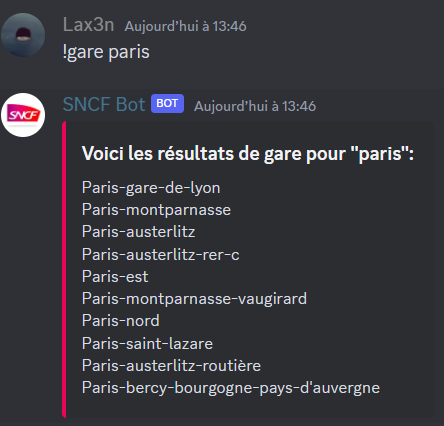
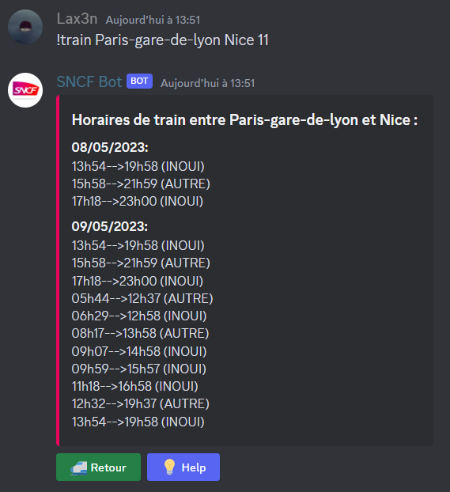
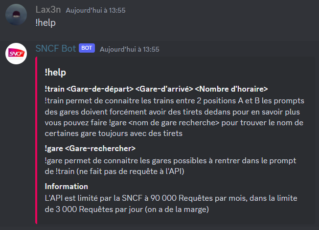

# Pré-requis:
### Pip:
1. discord
2. requests
3. discord.ui
### python
1. python 3.9 minimun
# Principal:
Voici un bot discord fait en python qui permet de savoir vos horaire de train. Il prend en charge plusieurs commande comme : "!train","!gare" et "!help".
Il s'utilise de la façon suivante: !gare \<nom de gare\>.

Il faudra ensuite mettre le bon output voulu dans la commande : !train \<gare départ\>  \<gare arrivée\>  \<nombre output\>(les gare départ et gare d'arrivée doivent venir de !gare avec le bon orthographe pour marcher).

Et enfin une commande: !help.

